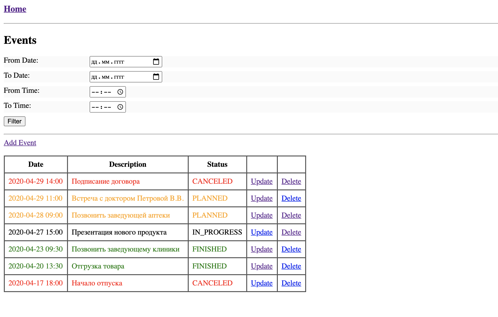
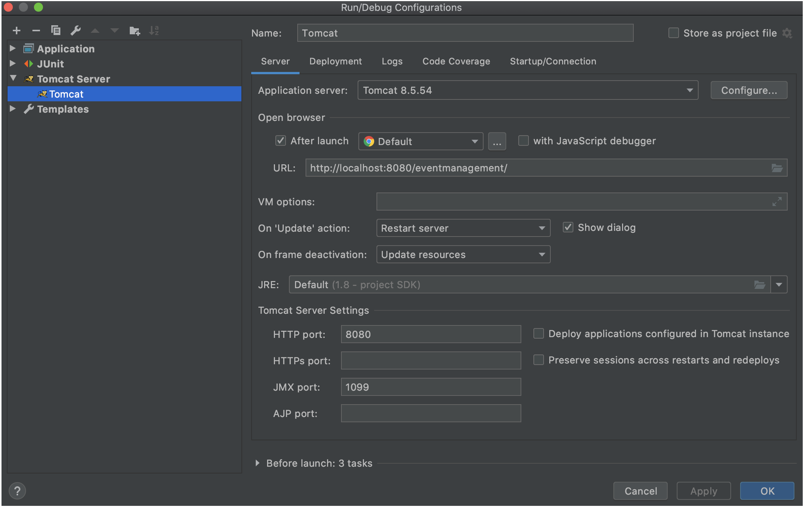
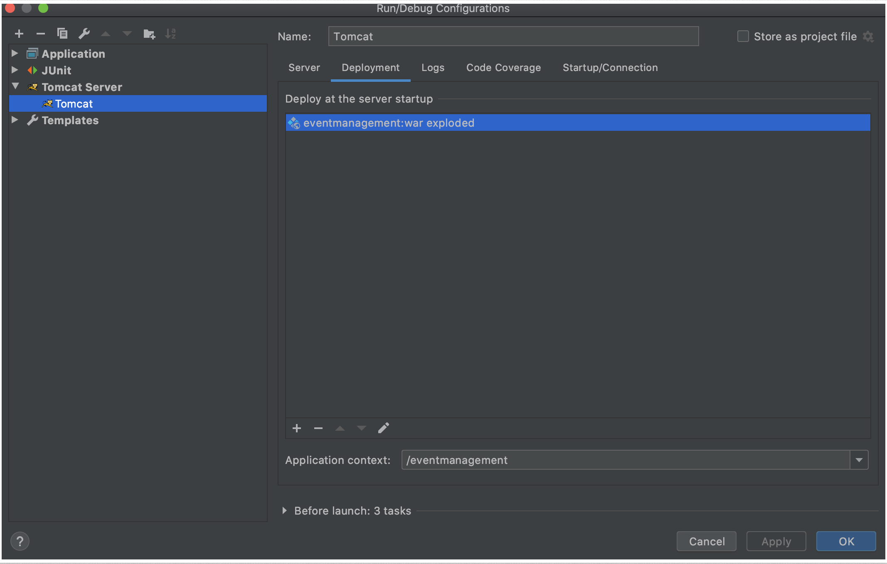

Java Enterprise Project: Event Management  
(Управление мероприятиями)
====================================================================

Используемые технологии /инструменты / фреймворки:  
Maven/ Servlet/ Spring/ JDBC/ JPA(Hibernate)/ JUnit/ PostgreSQL + HSQLDB 

#### Функциональность приложения:
- создание пользователем новых мероприятий;
- редактирование и удаление существующих; 
- фильтрация мероприятий по дате и времени;
- изменение цвета текста согласно статусу мероприятия  
----

#### Главное меню (screenshot):

#### Для запуска приложения настроить Tomcat: 

